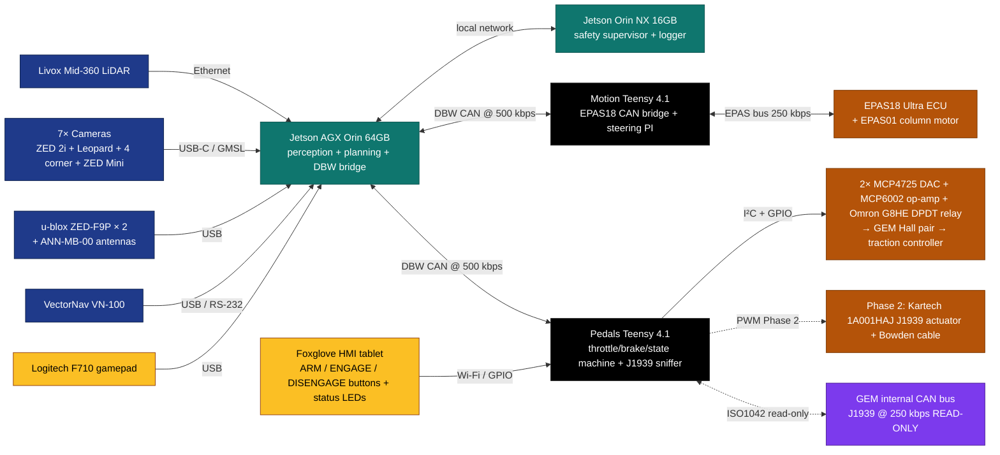
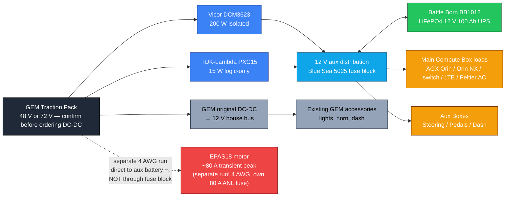
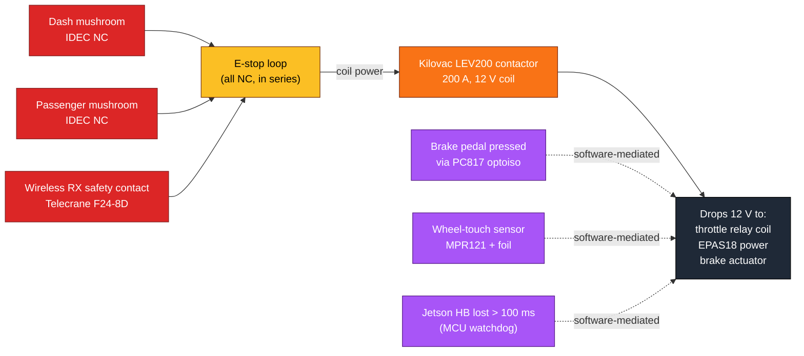
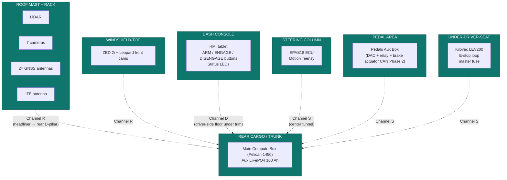
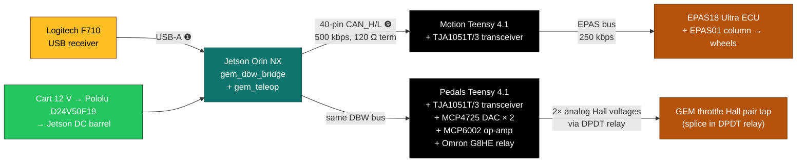

# Wiring Diagram — GEM E4 Self-Driving Conversion

The canonical wiring reference. Diagrams render on GitHub. Each section is a separate concern (data, power, safety) for clarity.

---

## 1. Data flow — sensors / autonomy / DBW / actuators



The DBW CAN bus is **the spine**: 500 kbps, twisted pair, 120 Ω termination at each end, Deutsch DT04-4P at every node. Three buses kept physically isolated for fault containment (DBW / EPAS / vehicle J1939) — see Master Plan PART A.6.

---

## 2. CAN bus topology — three isolated buses

```mermaid
flowchart TB
  subgraph DBW["DBW BUS — 500 kbps (our internal protocol)"]
    direction LR
    JCAN[Jetson can0<br/>via 40-pin GPIO + transceiver]
    MCAN1[Motion Teensy CAN1]
    PCAN1[Pedals Teensy CAN1]
    JCAN <-->|120Ω term| MCAN1
    MCAN1 <-->|120Ω term| PCAN1
  end

  subgraph EPAS["EPAS BUS — 250 kbps (DCE Motorsport internal)"]
    direction LR
    MCAN2[Motion Teensy CAN2]
    EPASECU[EPAS18 Ultra ECU<br/>signal conn pins 19/20 or 29/30]
    MCAN2 <-->|120Ω term| EPASECU
  end

  subgraph J1939["VEHICLE J1939 BUS — 250 kbps (READ-ONLY)"]
    direction LR
    GEMCAN[GEM internal CAN<br/>diagnostic port]
    ISO[ISO1042 isolator]
    PCAN2[Pedals Teensy CAN2]
    GEMCAN -->|do NOT TX| ISO
    ISO --> PCAN2
  end

  classDef dbw  fill:#dbeafe,stroke:#1e3a8a,color:#000
  classDef epas fill:#fed7aa,stroke:#9a3412,color:#000
  classDef j1939 fill:#fecaca,stroke:#991b1b,color:#000
  class JCAN,MCAN1,PCAN1 dbw
  class MCAN2,EPASECU epas
  class GEMCAN,ISO,PCAN2 j1939
```



- **Why three buses?** Single bus = single fault domain. A glitch on the J1939 vehicle CAN can never propagate into our DBW bus, can never propagate into the EPAS bus.
- **The Motion Teensy bridges DBW ↔ EPAS in firmware** (not physically). Adds ~10 ms latency, isolates safety-critical steering from everything else.
- **NEVER transmit on the J1939 bus.** It's read-only. Writing to it can brick the GEM traction controller.

---

## 3. Power one-line diagram



**Critical wiring rules:**
- **Single-point star ground** at aux battery negative.
- **EPAS18 motor power** gets its own 4 AWG run direct to aux battery, NOT shared with logic ground (steering motor draws ~80 A transient — would brown out everything else).
- **CAN cable shields** drained at one end only (Jetson end), never both.
- Cable runs: 14 AWG for 12 V distribution, 22–24 AWG MIL-spec Tefzel (M22759) for signal.

### Aux 12 V fuse block layout (Blue Sea 5025, 6 fuses + spares)

| Fuse | Rating | Rail | Load |
|---|---|---|---|
| F1 | 20 A | 12 V → Jetson | AGX Orin (90 W peak via 19 V boost) |
| F2 | 10 A | 12 V → Jetson | Orin NX (25 W) |
| F3 |  5 A | 12 V → switch | Mikrotik 10 G switch (10 W) |
| F4 |  5 A | 12 V → modem | Cradlepoint LTE (8 W) |
| F5 |  3 A | 12 V → sensors | CANable, IMU, F9P (~6 W) |
| F6 | 10 A | 12 V → Steering Aux Box | Motion Teensy + ODrive logic + relay |
| F7 |  5 A | 12 V → Pedals Aux Box | Pedals Teensy + DACs + DPDT relay coil |
| F8 | 15 A | 12 V → brake actuator (Phase 2) | Kartech 1A001HAJ J1939 actuator |
| F9 | 10 A | 12 V → cabin AC | Peltier cabinet AC |
| F10 |  5 A | 12 V → dash | Status LEDs + dash buttons |

**Separate, in-line ANL fuse for EPAS18:** 80 A, 4 AWG run from aux battery + → Kilovac contactor → EPAS18 power pins A/B. **Not in the fuse block.**

---

## 4. Safety kill-chain — hardware-only path



**The whole point**: **software is never in the kill path.** Open the loop → Kilovac drops physically → 12 V disappears from every actuator simultaneously, before any MCU can react.

The **soft** disengage paths (brake-pedal-pressed, wheel-touch, watchdog) are software-mediated and stop autonomy via the state machine, but if anything in software fails, the hardware loop is still there.

---

## 5. Per-zone cabling (the actual wires)

Cart is divided into **7 zones** connected by **3 cable channels**:



| Channel | Path | Length | Cables |
|---|---|---|---|
| **R** | roof front-center → rear D-pillar → trunk | ~3 m | LiDAR Cat6+12V, ZED 2i USB-C, Leopard GMSL, 2× GNSS coax, LTE coax, wireless E-stop coax, GPS aux |
| **D** | dash → driver-side floor under sill trim → trunk | ~2.5 m | DBW CAN, dash button bundle, HMI tablet Cat6 |
| **S** | steering column / pedal area → center tunnel → under-seat → trunk | ~2 m | DBW CAN (Steering side), DBW CAN (Pedals side), EPAS power 4 AWG, J1939 tap, throttle harness tap, brake actuator (Phase 2) |

Use 1.5" split-corrugated loom on each channel; secure every 30 cm with adhesive zip-tie mounts; pass through grommeted holes only.

---

## 6. Jetson port assignments (right now, on the Yahboom Orin NX Super)

(Detailed port-by-port + boot sequence: `Hardware/JETSON_WIRING_DIAGRAM.md`. Quick map below.)

```
                         JETSON ORIN NX SUPER (Yahboom carrier)
       ┌─────────────────────────────────────────────────────────────────┐
       │                                                                 │
       │  ❶ USB-A 3.0 ◄── Logitech F710 receiver (gamepad → /joy)        │
       │  ❷ USB-A 3.0 ◄── (sensor / hub later)                           │
       │  ❸ USB-A 3.0 ◄── (sensor)                                       │
       │  ❹ USB-A 3.0 ◄── (sensor)                                       │
       │  ❺ Ethernet (eno1) ◄── LiDAR (Phase 1+) / dev internet          │
       │  ❻ USB-C ◄── currently Mac (USB-net + power); ZED 2i later      │
       │  ❼ HDMI ◄── optional monitor for direct GUI                     │
       │  ❽ DC barrel 19 V ◄── from cart 12 V via Pololu D24V50F19 buck  │
       │                                                                 │
       │  ❾ 40-pin GPIO header (top edge):                               │
       │      CAN_H ──► DBW bus → Motion + Pedals Teensies               │
       │      CAN_L ──► (twisted pair, 120 Ω term both ends)             │
       │                                                                 │
       └─────────────────────────────────────────────────────────────────┘
```

---

## 7. First-light minimum wiring (Phase 0c — RC drive at 3 mph)

The absolute minimum to drive the cart from the Jetson with a gamepad:



That's six physical things to wire up. No sensors, no perception, no autonomy stack — just **gamepad → Jetson → CAN → Teensies → cart actuators**. Brake = your foot until Phase 2.

---

## See also

- `JETSON_WIRING_DIAGRAM.md` — port-by-port for the Yahboom carrier specifically
- `JETSON_PLUG_LAYOUT.md` — earlier deeper layout notes
- `system_design.md` — locked component selection + procurement priority
- `cart_parameters.md` — vehicle geometry + sensor extrinsics
- `CART_VISIT_DAY1.md` — checklist for the cart inspection
- Master plan PDF — for the canonical system architecture overview
